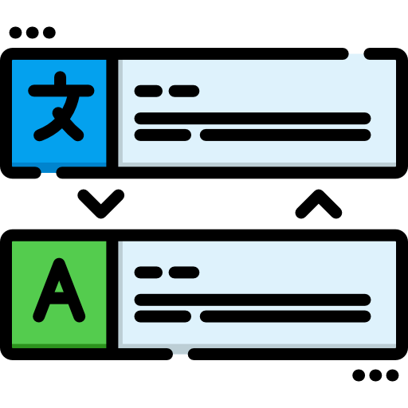

<div id="top"></div>

<!-- PROJECT LOGO -->
<br />
<div align="center">
  <a href="https://github.com/tassianoalencar/laravel-nova-ptbr-localization">
    
  </a>

  <h3 align="center">Laravel Nova PTBR Localization</h3>
</div>

<!-- GETTING STARTED -->
## Instalação

Adicione a dependência no projeto
   ```sh
   composer require tassianoalencar/laravel-nova-ptbr-localization
   ```
Publique os recursos
   ```sh
   php artisan vendor:publish --tag=laravel-nova-ptbr-localization
   ```
Altere o locate no arquivo de configuração `config/app.php` para:
   ```php
   'locale' => 'pt-BR',
   ```
Altere o timezone no arquivo de configuração `config/app.php` para:
   ```php
   'timezone' => 'America/Sao_Paulo',
   ```

<p align="right">(<a href="#top">back to top</a>)</p>
